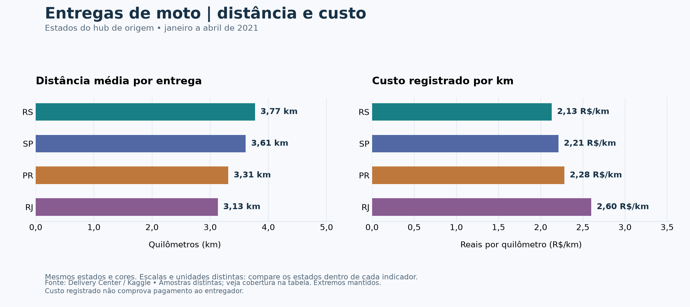

# Foods & Goods

Projeto de análise de dados com **SQL (PostgreSQL), Python, pandas e Matplotlib**, desenvolvido no DBeaver e no VS Code com Jupyter.

## Do panorama à pergunta de negócio

O estudo começou com um panorama geral da operação: pedidos concluídos por dia e mês, variação mensal (MoM), valor bruto movimentado (GMV) e ticket médio (AOV). A partir dessa exploração, simulamos uma demanda da equipe de preços: entender as diferenças de distância antes de discutir remuneração de entregas.

**Pergunta:** como a distância das entregas de moto varia entre os estados atendidos?

Este repositório reúne a etapa final de logística, os gráficos e a conclusão. O contexto é um exercício de análise, não um trabalho realizado para o iFood ou para o Delivery Center.

## Comparação visual



| Estado do hub | Distância média por entrega | Custo registrado por km |
|---|---:|---:|
| RS | 3,77 km | R$ 2,13/km |
| SP | 3,61 km | R$ 2,21/km |
| PR | 3,31 km | R$ 2,28/km |
| RJ | 3,13 km | R$ 2,60/km |

O RS apresentou a maior distância média e o menor custo registrado por quilômetro; no RJ, observou-se o comportamento oposto. Distâncias maiores não implicam custos proporcionalmente maiores. Uma parcela fixa por entrega poderia contribuir para esse padrão, mas essa hipótese não foi comprovada.

**Limites:** os indicadores têm amostras distintas, existem distâncias extremas mantidas no cálculo e custo registrado não comprova pagamento ao entregador. A distância aparece no denominador de custo/km; a relação observada não demonstra, por si só, desigualdade de remuneração. Não propomos preços.

## Como foi calculado

- Distância média: entregas `DELIVERED`, motoristas `MOTOBOY`, agrupadas pelo estado do hub de origem. Distâncias nulas não entram na média.
- Custo/km: soma de `order_delivery_cost` dividida pela soma das distâncias dos mesmos pedidos elegíveis, em km.
- A distância é agregada por pedido antes do join ao custo, evitando repetir o custo quando há várias entregas para o mesmo pedido.
- Para custo/km, todas as entregas concluídas do pedido precisam ser de moto e ter distância positiva e preenchida. Custos nulos ou negativos ficam fora; custos zero são mantidos.
- O notebook apresenta cobertura, valores ausentes, extremos e mediana para apoiar a leitura. Distância registrada não equivale necessariamente à quilometragem total trabalhada pelo entregador.

## Arquivos

- `01_logistica.ipynb`: notebook com SQL, resultados salvos, gráficos, metodologia e conclusão.
- `sql/`: consultas de distância, custo/km e qualidade.
- `graficos/`: gráficos exportados em PNG.
- `requirements.txt`: dependências Python.

## Fonte e período

[Delivery Center: Food & Goods orders in Brazil — Kaggle, Nosbielcs](https://www.kaggle.com/datasets/nosbielcs/brazilian-delivery-center).

Recorte de pedidos de **janeiro a abril de 2021**. Os estados são os dos hubs de origem, não necessariamente os dos clientes. Os dados brutos não são redistribuídos neste repositório; obtenha-os na fonte e observe suas condições de uso.

## Como abrir e reproduzir

Para ler a análise, abra o notebook no GitHub ou no VS Code: os resultados e gráficos já estão salvos.

Para executar novamente:

1. Obtenha a base no Kaggle e importe `orders`, `deliveries`, `stores`, `hubs` e `drivers` para o schema PostgreSQL `"Foods and Goods"`. Preserve os nomes das colunas; IDs e distâncias devem ser numéricos, `order_delivery_cost` numérico e `order_moment_created` um timestamp. A criação/importação do banco é um pré-requisito e não é automatizada aqui.
2. Crie o ambiente e instale as dependências:

   ```bash
   python3 -m venv .venv
   source .venv/bin/activate
   python -m pip install -r requirements.txt
   ```

3. No VS Code, instale as extensões Python e Jupyter e selecione `.venv` como kernel do notebook.
4. A conexão usa `localhost:5432`, banco e usuário `postgres` por padrão. Configure `PGHOST`, `PGPORT`, `PGDATABASE` e `PGUSER` no ambiente antes de iniciar o VS Code, se necessário. A senha é solicitada via `getpass`; não é salva no código.
5. Execute as células em ordem. As consultas usam transações somente de leitura. Os gráficos são exportados para `graficos/` no diretório de execução.

## Encerramento

O projeto conclui o escopo de exploração, comparação descritiva e comunicação visual. Uma decisão real de remuneração exigiria validar as distâncias extremas, esclarecer o campo de custo e obter dados de repasses aos entregadores.
